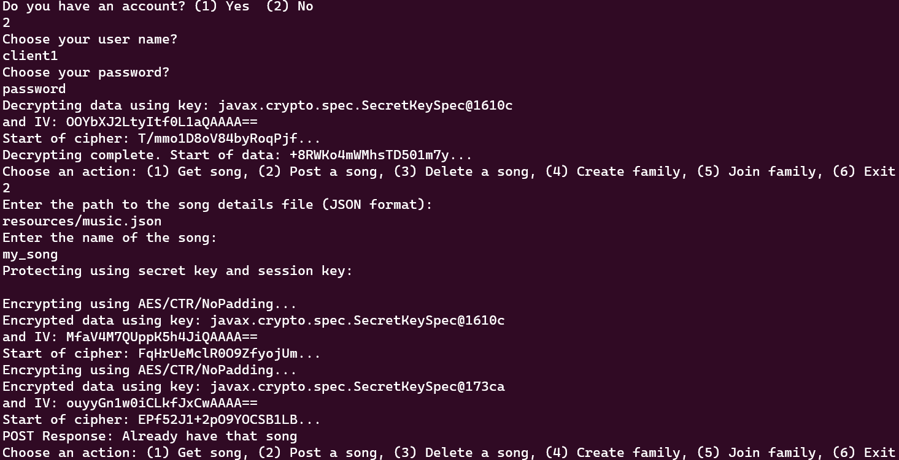
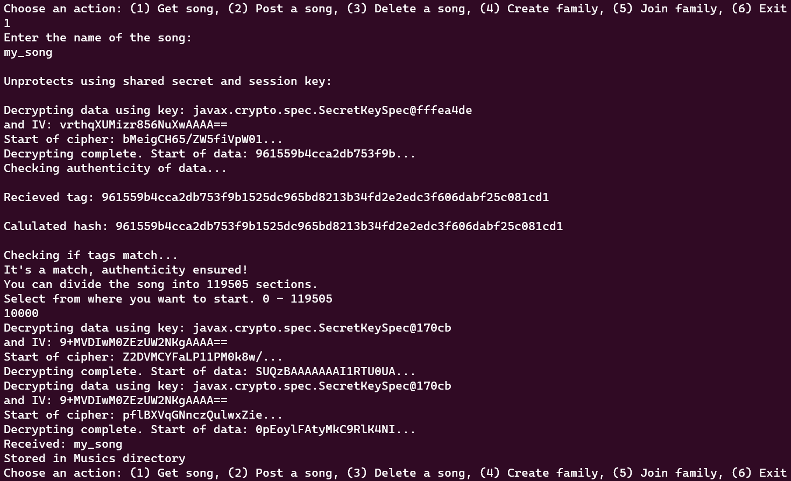
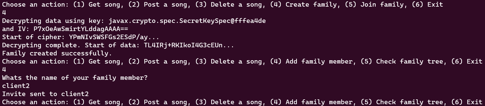
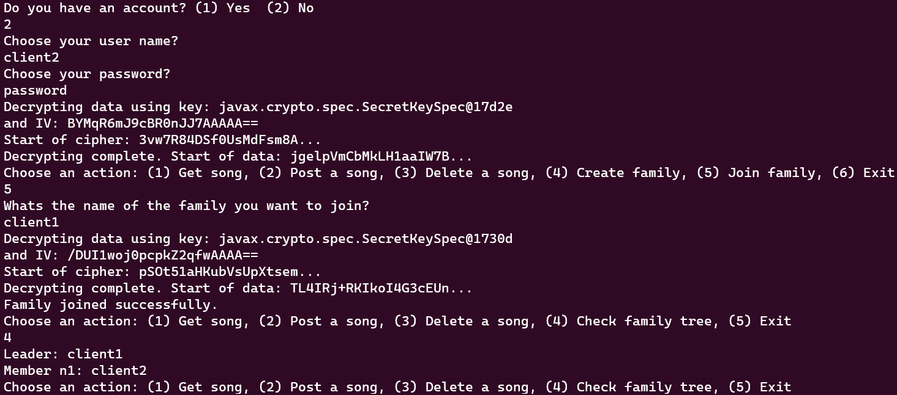

# A16 GrooveGalaxy - Read Me

<!-- this is an instruction line; after you follow the instruction, delete the corresponding line. Do the same for all instruction lines! -->


## Team

| Number | Name              | User                             | E-mail                                       |
| -------|-------------------|----------------------------------| ---------------------------------------------|
| 93088  | João Leitão       | <https://github.com/joaol9090>   | <mailto:joaoafleitao@tecnico.ulisboa.pt>     |
| 99195  | Daniel Gomes      | <https://github.com/DanielGomes0>| <mailto:danieljcgomes@tecnico.ulisboa.pt>    |
| 108924 | Simen Myrrusten   | <https://github.com/Nemisis84>   | <mailto:simen.myrrusten@tecnico.ulisboa.pt>  |


  


## Contents

This repository contains documentation and source code for the *Network and Computer Security (SIRS)* project.

The [REPORT](REPORT.md) document provides a detailed overview of the key technical decisions and various components of the implemented project.
It offers insights into the rationale behind these choices, the project's architecture, and the impact of these decisions on the overall functionality and performance of the system.

This document presents installation and demonstration instructions.

<!-- *(adapt all of the following to your project, changing to the specific Linux distributions, programming languages, libraries, etc)* -->

## Installation

To see the project in action, it is necessary to setup a virtual environment, with N networks and M machines.  

The following diagram shows the networks and machines:


### Prerequisites

All the virtual machines are based on: Linux 64-bit, Kali 2023.3  

[Download](https://cdimage.kali.org/) and [install](https://github.com/tecnico-sec/Setup/blob/master/KaliSetup.md) a virtual machine of Kali Linux 2023.3.  
Clone the base machine to create the other machines.

### Machine configurations

For each machine, there is an initialization script with the machine name, with prefix `init-` and suffix `.sh`, that installs all the necessary packages and makes all required configurations in the a clean machine. Scripts can be found in /bash_scripts. They need to be ran from root folder for the project. For example:
```sh
./bash_scripts/init-vm1.sh
```

Inside each machine, use Git to obtain a copy of all the scripts and code.

```sh
$ git clone https://github.com/tecnico-sec/a16-joao-daniel-simen.git
```

Next we have custom instructions for each machine. For additional networking configuration info look into the network/ folder. Each machine has its own folder with the network configuration that should be pasted into /etc/network/interfaces in the machines.

#### Machine VM1

This machine runs the database. It runs PostgreSQL 14.10 and has a databaseconnector written in Java. The database acts as can act as a server with custum code written for this purpose. 

<!-- *(describe what kind of software runs on this machine, e.g. a database server (PostgreSQL 16.1))* -->

To verify psql version:

```sh
$ psql --version
```
This should return 14.10.

To run database and open the DB shell you need to run this: 
```sh
sudo -u postgres psql
sudo service postgresql start
```
Opens psql shell. Change password:
```sh
\password postgres
```
Enter "password" twice to change the password to "password". To populate and test the DB please run each command in /database/setup_database.sql individually. It could be ran as a script, but to not deal with permission this is the easiest way. The final command:

```sh
SELECT * FROM media;
```

The expected results are:


 user_id |     owner      | title |           file
 
---------+----------------+-------+---------------------------

   1     | eduardo_albino | Numb  | Ed_SheeranShape_of_youpop

(1 row)

The instructions in the file /database/setup_database.sql sets up the DB and inserts a dummy file. The final command extracts the content. Getting this result means that the DB is ready to go. 

To run the database server run this command:
```sh
sudo mvn compile exec:java -Dmainclass=database.DatabaseConnector
```
The output should be: "Database server started on 192.168.1.100:80"

#### Machine VM2

This is the router. Run the ./bash_scripts/firewall.sh to establish the firewall rules. This will also list the rules: 

Chain INPUT (policy ACCEPT)
target     prot opt source               destination         
REJECT     all  --  anywhere             anywhere             reject-with icmp-port-unreachable

Chain FORWARD (policy ACCEPT)
target     prot opt source               destination         
ACCEPT     tcp  --  anywhere             192.168.1.1          tcp dpt:http
ACCEPT     tcp  --  192.168.1.1          anywhere             tcp spt:http state RELATED,ESTABLISHED
ACCEPT     tcp  --  192.168.1.1          192.168.0.100        tcp dpt:http
ACCEPT     tcp  --  192.168.0.100        192.168.1.1          tcp spt:http state RELATED,ESTABLISHED
REJECT     all  --  anywhere             anywhere             reject-with icmp-port-unreachable

Chain OUTPUT (policy ACCEPT)
target     prot opt source               destination         
Chain PREROUTING (policy ACCEPT)
target     prot opt source               destination         

Chain INPUT (policy ACCEPT)
target     prot opt source               destination         

Chain OUTPUT (policy ACCEPT)
target     prot opt source               destination         

Chain POSTROUTING (policy ACCEPT)
target     prot opt source               destination 

#### Machine VM3

This is the application server. Run:
```sh
sudo mvn compile exec:java -Dmainclass=server.HttpApplicationServer
```
This should provide the outout: "Server started on 192.168.1.1:80"

### Machine VM4

This is the client. Run:
```sh
sudo mvn compile exec:java -Dmainclass=client.SimpleHttpClient
```
This should return a CLI with the first output beeing "Do you have an account? (1) Yes  (2) No"

## Demonstration

Now that all the networks and machines are up and running, we need to set up the network as in [Infrastructure](https://github.com/tecnico-sec/a16-joao-daniel-simen/blob/main/network/Infrastructure.png). For a guide to make connection take a look at [Virtual networking](https://github.com/tecnico-sec/Virtual-Networking) You can also edit the interfaces opening this file "/etc/network/interfaces" and inserting the /networking/[VM]/network_configs.txt to save the network configurations on rebooting of the VM.

Run these commands in each seperate machine to start the application:

```sh
sudo mvn compile exec:java -Dmainclass=server.HttpApplicationServer
```
```sh
sudo mvn compile exec:java -Dmainclass=database.DatabaseConnector
```
```sh
sudo mvn compile exec:java -Dmainclass=client.SimpleHttpClient
```


We will only look at the client terminal for this demonstration, but the application server and database can also provide you with some useful print statements for more insigth. This demo is ran on localhost, so the terminal will look slightly different than on the virtual machines. However, the functionality will remain the same.  

1. Create user and post your first song. An example song can be found in resources/music.json. 

In this command sequence, we have created a user "client1" with password "password". We have posted the song "resources/music.json" and named it "my_song". We can see print staments showing the cryptographic operations. 
2. Now the user can ask for the song in the database pressing the option "1":

The user asks for the song name "my_song" which we entered earlier and recieves it after. The user can decide where in the song he/she wants to start, and only the neccessary decryption will be executed. As you can see the HMAC Tags are compared, and in this case equal. 
3. Finally, we will demonstrate the family sharing concept. First we need to create a new client, in this case with username "client2". Then we will create the family using either client(in this case client1). Then an invite needs to be sent to the server. The client joining will need to join the family by entering the username of the family leader(client1) and are then a part of the family sharing.  

client1:

client2:


To check the members of a family, all members can enter "5". Now the family member will be able to share all songs entered by any of the members. For authenticity the family key will be used instead of the long-term key (inital secret of each client). 

The application is made to demonstrate the functionality in a simple form. Som edge cases might lead to crashes on any part of the communication. 


<!-- *(give a tour of the best features of the application; add screenshots when relevant)*


*(IMPORTANT: show evidence of the security mechanisms in action; show message payloads, print relevant messages, perform simulated attacks to show the defenses in action, etc.)* -->

This concludes the demonstration.

## Additional Information

### Links to Used Tools and Libraries

- [Java 11.0.16.1](https://openjdk.java.net/)
- [Maven 3.9.5](https://maven.apache.org/)
- Java built in libraries for I/O, SQL, networking and crypto

### Versioning
We use [SemVer](http://semver.org/) for versioning.  
### License

This project is licensed under the MIT License - see the [LICENSE.txt](LICENSE.txt) for details.
----
END OF README
