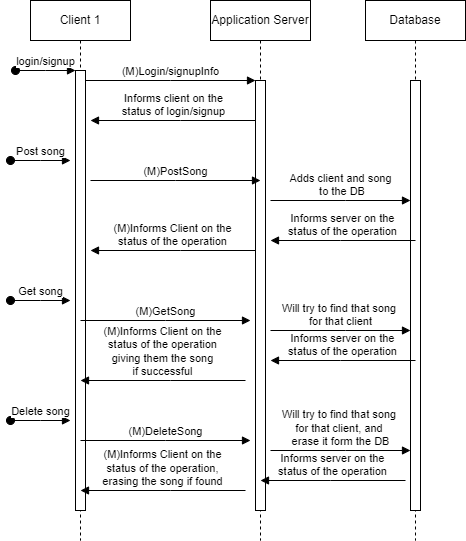
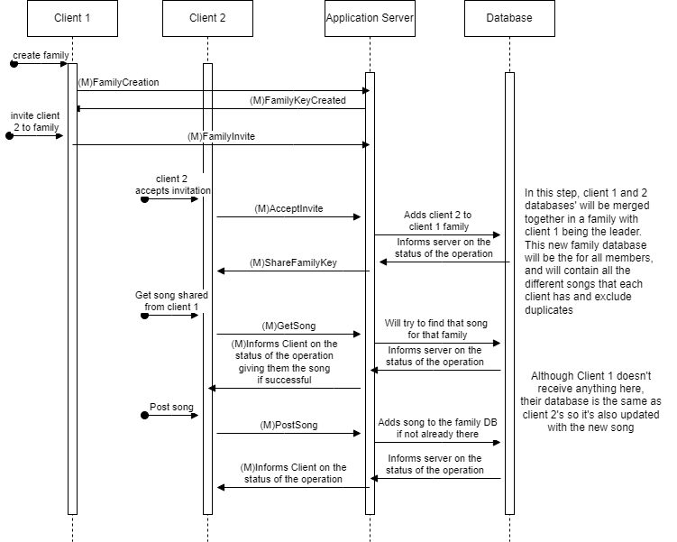

# C16 GrooveGalaxy Project Report

## 1. Introduction

Our buisness scenario is the GrooveGalaxy. We have created a simple application with a focus on security, testability and low effort on user experience. There are three main parts of the project: secure document, infrastructure and the security challenge. For the secure document AES and HMAC are used to provide confidentiality and authenticity, as those were the requirements given in the project description. Furthermore, we used HTTP for communication between clients and the application server and between the application server and the database(DB). To make our system even more secure we have implemented a firewall on the router which connects the application server and database with the "world". In the security challenge, we have implemented a family key shared among the family clients in a given family. Finally, we have implemented playback of audio such that users can quickly skip to a certain point in a song. This is enabled by the properties of the CTR mode used in the AES encryption. Underneath, you can see the architecture of our network:

<!-- (_Provide a brief overview of your project, including the business scenario and the main components: secure documents, infrastructure, and security challenge._)

(_Include a structural diagram, in UML or other standard notation._) -->

## 2. Project Development

### 2.1. Secure Document Format

#### 2.1.1. Design

We start with the assumption that we have one shared secret for each user shared between the user and the application server. For this challenge, we were asked to provide authenticity of the song data and confidentiality between the server and the owner. 

To ensure authenticity we use HMAC. In HMAC a secret is XORed with some constants, concatenated with the message and hashed. This produces a unique tag, which can only be produced by having the same message input, secret and hashing algorithm. We create the tag using SHA256, a secure hashing algorithm. 

For confidentiality we use the recognized symmetric key encryption algorithm AES. This is a secure way of encrypting data, assuming the implementation is good. We used CTR and no padding. No padding is necessary when we use the CTR mode. The CTR mode has the property of being able to decrypt in parallel, meaning different parts of the encryption can be encrypted independently and simultaneously. This property is especially desired in the case of songs as it allows us the decrypt only certain parts. This allows us to quickly encrypt the part of the song that is listened to, skipping encryption of the previous parts when the user skips to a certain part of the song. This becomes relevant later on, during the security challenge. 

For the CTR mode, we also need a unique nonce (or IV). For this, an RNG can be used to generate an IV, given that collisions are highly unlikely. For this purpose the library java.security.SecureRandom is used. Under the assumption that this PRNG is secure, this is a sound way to produce the nonce. For future reference, we will use the term IV instead of nonce. The IV is sent in cleartext with the rest of the encrypted data in a concatenated string: Ciphered content + " " + IV. The IV is used to create the uniqueness of the encryption, and it is therefore secure to send this unencrypted. 

As the project evolved, it became clear that there was a need for a session key. The initial shared secret is handled as a long-term secret, and thereby should not be used for providing encryption of communication. It is rather used for authenticity and session key generation. Later, we will also explain the implementation of a family key, which will replace the long-term key for authenticity where it exists. However, to explain the mechanisms of the secure document functions, the use of the long-term symmetric key is used. 

Below you can see the message format:

{TAG, {plaintext}Klt, IVlt}Ks , IVs

The TAG is the HMAC tag composed like this:

HMAC( {plaintext}Klt, Klt)

The variables are:
- Ks = session key
- Klt = long-term symmetric key
- IVlt = IV used for the CTR mode in the inner encryption with Klt
- IVs = IV used for the CTR mode in the outer encryption with Ks
- HMAC, the function creating the Tag used for authenticity. 

<!-- (_Outline the design of your custom cryptographic library and the rationale behind your design choices, focusing on how it addresses the specific needs of your chosen business scenario._) -->

<!-- (_Include a complete example of your data format, with the designed protections._) -->

#### 2.1.2. Implementation

For the implementation of the secure document, Java was used as it was used for the whole project. The libraries used for the secure document was:

- com.google.gson.* for handling json
- java.io.* for I/O ahandling
- java.crypto.* for IV, key generation, HMAC and ciphering
- java.security.* for RNG and key representation. 

#### Protect()

For the secure document part of the project, we were asked to have three main methods: protect(), unprotect() and verify(). The protect() and unprotect() methods are implemented twice in the code with similarities. This is due to their specific use in the entities. They can be found in both the API_server.java and the API_client.java. The description below will only focus on the cryptographic and security properties of the functions. 

The protect() method is executed like this:
1. Input: file to be protected, symmetric key path and session key path.
2. Encrypt the input file using the symmetric key.
3. Calculate the HMAC tag from the encrypted file and symmetric key.
4. Encrypt the HMAC tag and cipher (from using the symmetric key) using the session key. 

As the steps explain, we do two rounds of encryption. First use the symmetric key, which initially will be the shared secret (later this can be replaced with the family key). This is to provide authenticity and confidentiality of the secured document. The latter encryption using the session key is also done to provide confidentiality but is mainly done to not expose the long-term key. The reasoning for implementing a session key can be found in 2.2.2. Server Communication Security.

The unprotect() method is executed like this:
1. Input: file to be unprotected, symmetric key path and session key path.
2. Grab the full tag, encrypted message and IV.
3. Decrypt the encrypted message using the session key. 
4. Run the check() method to check authenticity with input: the symmetric key, decrypted message(using the session key) cipher and the received tag. 
5. Decrypt the message using the symmetric key.

The check() method is used in the unprotect method in the application because it is always run with the decryption of the document. The purpose of this method is to ensure authenticity by calculating the tag from a message and comparing the calculated tag with the received tag. It can also be run in isolation for demonstration purposes. Here is the description of the check() method:

1. Input: File to be checked, HMAC tag, symmetric key path.
2. Calculate the HMAC tag from the input file. 
3. Compare the calulated tag T' with the received tag T. 

<!-- TODO: if time-> challenges? -->

<!-- (_Detail the implementation process, including the programming language and cryptographic libraries used._) -->

<!-- (_Include challenges faced and how they were overcome._) -->

### 2.2. Infrastructure

#### 2.2.1. Network and Machine Setup
We have a total of 4 VMs in our [Infrastructure](network/Infrastructure.png); Client(s), application server, router and database server. 

For the communication between the instances, we use HTTP. We made all communications using Java libraries. No major framework was used. As we wanted control over the security and the information flow we think this was the best option. Many frameworks handle a lot of the security properties for you, which for the most part is good, but for this project did not make sense. Using simple libraries allowed us to do all the changes we wanted, without managing the configuration and setup of a framework. Using a framework such as Spring Boot was a considered option. 

As for the chosen communication protocol, we choose HTTP, because of its familiarity and properties. For a client sending a request in a client-server communication, HTTP is the go-to protocol used in technology today. This easily allows us to request operations which can execute the CRUD operations. One thing to be aware of is that we did not enable clients to update data in the database, as songs are usually immutable. 

We did not implement HTTPS, meaning HTTP with TLS. This is a downside, and with more time and effort, this would be recommended. First of all, HTTPS is an industry-standard which are used wherever the HTTP protocol is used. HTTPS allows us to provide machine authentication through certificates, meaning we can verify that the server is who we expect it to be. The downsides of choosing HTTP instead of HTTPS are explained more when looking at the attacker model later in the report. 

We will now explain the technology and reasoning for each participant:

##### Client
An HTTP client class is made for asking for songs, adding songs and deleting songs. Built using mainly java.net.http.* packages. A CLI is also provided. This lightweight version of a client was implemented with a focus on being adaptable to a changing application and network. A web interface could also be implemented, but as it would need to be implemented with the security classes already made in Java, this would lead to more complexity. For the project, a simple CLI is sufficient to illustrate the security properties of the application. 

##### Application Server

We manually implemented a server application, as it was enough for our needs, and allowed for good flexibility and responsiveness. Implementing a framework like Spring Boot could be possible, but configuring a framework we did not know was a risk we did not want to take. The application server acts as an HTTP server when communicating with clients, and then acts as an HTTP client when requesting data from the DB. In hindsight, this could have been solved more smoothly with the use of JDBC. However, with limited knowledge and communication of databases and their application layer protocols, we did not know that this was an obvious solution. 

#### Database

We chose PostgreSQL as our database due to its open-source nature and simplicity of use and deployment. The extensive community support was also an important aspect as well as aligning with our project's requirements.

<!-- (_Provide a brief description of the built infrastructure._) DONE -->

<!-- (_Justify the choice of technologies for each server._) SONE -->

#### 2.2.2. Server Communication Security

#### Firewall
One of the ways to secure both the database server and application server was the use of a firewall at the router. The applied rules can be found in /network/VM2/firewall. We explicitly only allow these communications:
- Any computer can access the application server with HTTP (port 80).
- The application server can communicate with established HTTP connections.
- The application server can initiate an HTTP connection with the database server.
- The database server can communicate with an established HTTP connection with the application server.
- All other communication won't be forwarded by the router.
- No communication to the router will be accepted. 

This leads to only the application server being exposed to the outside world, while the database can only be accessed by the application server. 

#### Session keys and user system

As the application and requirements expanded, we implemented key distribution. First of all, the client and application server don't start with the shared secret. As we can have an unknown number of clients, we share this long-term key when a new user registers. This also means that we added a user system to our database. The sharing of long-term keys is done in cleartext and should not be viewed as a part of the secure communication, and is only implemented for practical demonstration purposes. 

Furthermore, we implemented a session key as this would not expose the long-term key in the same way as if it had been used to encrypt communication. If a long-term key is compromised, it is no longer useful. However, if a session key is compromised, we could simply just create a new session key and share it using the long-term key. Also, the longer a key is in use, the easier it is to perform cryptoanalysis, which further emphasises the importance of using session keys. 

Additionally, using session keys allows us to provide forward secrecy if additional protocols are added. This means that the exposure of the long-term key won't compromise past session keys. Simply using a long-term key to share session keys doesn't provide forward secrecy, but together with, for instance, Diffie-Hellman key exchange perfect forward secrecy is achieved. This would be overkill for the scope of this project, both because of the time aspect and because the privacy required of our data is not the highest.  

In our case, the session key is shared just by encrypting it with the long-term key. This means that we are not providing forward secrecy or protection against replay attacks. In a real-world application, we would recommend using Diffie-Hellman. We would also recommend adding a mechanism for protection against replay attacks such as implementing either a timestamp, challenge or sequence number.

For the communication between the application server and DB, no encryption is used. Both the DB's network and application server's network are private and separated from the outside world, meaning that the risk of packet sniffing is reduced. In addition, this data is not sensitive at all, as it only contains content with possible copy rigth claims. Due to these reasons, remain this communication unprotected.

<!-- (_Discuss how server communications were secured, including the secure channel solutions implemented and any challenges encountered._)

(_Explain what keys exist at the start and how are they distributed?_) -->

### 2.3. Security Challenge

#### 2.3.1. Challenge Overview

For this challenge we were supposed to enable playpack in an efficent way so the user can skip to a certain part of the song. This makes our previous choice of CTR important, as this enables parallell encryption. Had we used CBC for instance, would this not be possible as it must be done sequentially. To use this property we needed to find a way to grab certain blocks of the encryption and decrypt them. This is different than we did before, as we by default decrypt from start to finish. To solve this challenge only code on the client side was changed. You could argue that we only need to encrypt certain parts of the song on the server side. However, that would mean that the user need to include the playback time in the get request itself, which in many cases is unreasonable. Also, what if the user wants to suddenly start the song at the start? Then we will need to do a new request, thereby adding additional time before the song is ready. Even though we in our application only allow the user to choose a certain point in the song once, this having the whole song and only encrypting what we need it the most reasonable choise. 

Additionaly, we added the concept of family sharing, where individual users can be members of the same family, and a protected song is accessible to all family members without modification. Each user still keeps their own secret key, but we also adds the consept of a family key shared among all members of a family. Only invited people can be a part of a family and the family key replaces the secret key when checking for authenticity of the document. You could also do this without a family key, just allowing users in a given family to access the songs other family members has in the DB. However, this does not provide the authenticity we want when requesting songs, and thus a family key solution was implemented. 

<!-- (_Describe the new requirements introduced in the security challenge and how they impacted your original design._) -->

#### 2.3.2. Attacker Model

In terms of what is trusted, the database is fully trusted, as it does not verify anything, if a request is made to the database, the one sending requests (server), has already been completely verified. The server is fully trusted, as it handles every part of the application with no restrictions and are created and maintained the developers and network managers. 

The users are treated as untrusted, since they don't access the database directly, and need pass through the server's verifications, as well as requiring the different security keys.  In addition, there are no limitation for who can become a user of the system which means that the clients remain untrusted. 

There are multiple vulnerabilities in our system:

1. If one a machine is compromised for some reason(related or unrelated to our application), will not only the client using that machine would be compromised, but all the family. The attacker will have access to the family key and gaini access to all the victim's songs. The attacker would be able to delete, get and post songs and thereby impact the rest of the family members.

2. Since we don't have HTTPS/TLS, our credentials are being sent in plain text. This way, if any attacker sniffs the inital packages it can impersonate the user and do CRUD operations. 

3. Another downside by not using HTTPS is the lack of a digital certificate from the server, making it possible for anyone to impersonate the server. This could lead to the server beeing able to do extensive attacks on the clients, because it is able to return malicous code in the request responses to the client. This includes installing rootkits at the client and adding the user to a botnet. The attacker could also imperonate the user as in 2. 

4. As no timestamp, sequence number or challenge/response pattern are added will both the client and server be suseptable for replay attacks.

5. Perfect forward secrecy are not provided as the key exchange don't use a method such as DH. As previously mentioned is this not a big consern as we are dealing with non-sensitive data. If our long-term keys at some point is exposed, all our previously communication can be decrypted as long as the packets containing the session keys were captured. 

<!-- (_Define who is fully trusted, partially trusted, or untrusted._) -->

<!-- (_Define how powerful the attacker is, with capabilities and limitations, i.e., what can he do and what he cannot do_) -->

#### 2.3.3. Solution Design and Implementation

We didn't have to redesign in terms of encryption. We had CTR in mind from the beginning, to be able to provide a good user experience. This solution allows us to be able to decrypt in parallel, meaning different parts of the encryption can be encrypted independently, allowing users to quickly start in the middle of an audio stream while still ensuring security. 

The implementation can be found in API_client.java. The user gets the option of choosing which ciphered block in the song it wants to start. In real life, this is not user-friendly as a slider (like used in Spotify) is more user-friendly. In addition, a song separated by blocks and not time is not very user-friendly. The user provides a block in a given range, and we will return the part of the song from that block.

For the family-sharing feature, we have two sequence diagrams below. To add some more context we have included a sequence diagram showing a user being created, posting a song, requesting a song and deleting a song.

The communication entities are the database, the router, the server and the client. The client can exchange information with the server and the server sends requests to the DB when needed. When a client requests something to be done(post song, get song, delete song), the server receives this request, handles it and forwards it to the database. The database will, if possible, execute said request and return data or operation status to the application server. Finally, the response will be forwarded to the client.

For the family sharing, we assume that client 1 and client 2 have already connected and posted content to the database. Client 1 creates a family, which will result in a family key being created. As previously mentioned will this key replace the shared secret in the protect operations. This means it will be used for creating the HMAC tag and the inner encryption. of the music data. To add members to the family, client 1 needs to send an invite to the respective clients (client 2 in this case). This invite is not forwarded to the clients, and in a real-world application, it should be forwarded so the clients are aware of the invite. After the invite is sent, client 2 can accept the invite and join the family. This will lead to their data being merged in the database, and having entries belonging to the family. The family key will then be shared with client 2. Now all songs are posted previously and from this point be available to both clients. 

<!-- (_Explain how your team redesigned and extended the solution to meet the security challenge, including key distribution and other security measures._)

(_Identify communication entities and the messages they exchange with a UML sequence or collaboration diagram._)   -->

## 3. Conclusion

We have created a simple application where a user can post and request music. A user can create or join a family to share his/her favourite music with the family. The application is minimalistic and the project was more concerned about the security properties. 

The communication between a server and a client is encrypted using AES to provide confidentiality. In addition, an HMAC tag is added to provide authenticity. Session keys are created and sent using the long-term shared secret, providing less exposure to the long-term secret. A family can share songs, and the authenticity is ensured by using a family key held by all entities of the family. When calculating the HMAC tag the long-term key is replaced with the family key. To provide a better user experience(at least in theory) we can start encryption at the start of each block from the CTR mode. This makes it possible for the user to skip songs quicker because it doesn't need to decrypt all the content before the point the user skipped to. 

Overall, the application has multiple vulnerabilities and weaknesses. The application interface would be improved by providing more error handling and a web interface. Furthermore, replay attacks are possible as we don't have a timestamp, challenge or sequence number. Other vulnerabilities are no forward secrecy and possible server impostering attacks. 

What we managed to achieve was authenticity from the HMAC, confidentiality (as long as keys are not compromised) from the AES encryption and a restrictive network not allowing unexpected requests because of our firewall. 

The project has given us practical experience in applied network security. We have designed and implemented security measures using sound Java libraries. While considering how an attacker would try to compromise our application. Furthermore, we have built a network and implemented a sound firewall. Even though development often is done using sound frameworks, does this hands-on experience give us experience in considering different relevant security practices. This will both be useful in a developer setting or as a security specialist. 

<!-- (_State the main achievements of your work._)

(_Describe which requirements were satisfied, partially satisfied, or not satisfied; with a brief justification for each one._)

(_Identify possible enhancements in the future._)

(_Offer a concluding statement, emphasizing the value of the project experience._) -->

<!-- ## 4. Bibliography

(_Present bibliographic references, with clickable links. Always include at least the authors, title, "where published", and year._) -->

----
END OF REPORT
