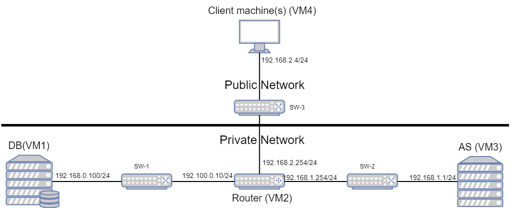

# CXX GrooveGalaxy Project Report

## 1. Introduction

Our buisniess scenario is the GrooveGalaxy. We have created a simple application with focus on security, testability and low effort on user experiency. There are three main parts of the project; secure document, infrastructure and the security challenge. For the secure document AES and HMAC are used to provide confidentiality and authenticity, as that were the requirements given in the project desciption. Furthermore, we used HTTP for communication between a server clients and an application server and between the application server an the database(DB). To make our system even more secure we have implemented a firewall on the router which connects the application server and database with the "world". In the security challenge we have implemented a family key shared among the family clients in a given family. Finally, we have implemented playback of audio such that user can quickly skip to a certain point in a song. This is enabled by the properties of the CTR mode used in the AES encryption

<!-- (_Provide a brief overview of your project, including the business scenario and the main components: secure documents, infrastructure, and security challenge._)

(_Include a structural diagram, in UML or other standard notation._) -->

## 2. Project Development

### 2.1. Secure Document Format

#### 2.1.1. Design

We start off with the assumtion that we have one shared secret for each user shared between the user and the application server. For this challenge we were asked to provide authenticity of the song data and confidentiality between the server and the owner. 

To ensure authenticity we use HMAC. In HMAC a secret is XORed with some constants, concatonated with the message and hashed. This produces a unique tag, which only can be produced by having the same message input, secret and hashing algorithm. We create the tag using SHA256, a secure hashing algorithm. 

For the confidentiality use the recognized symmetric key encryption algorithm AES. This is a secure way of encrypting data, assuming the implementation is good. We used CTR and no padding. No padding is nessecary when we use the CTR mode. The CTR mode has the property of beeing able to decrypt in parallell, meaning different part of the encryption can be encrypted independently and simultanously. This property is especially desired in the case of songs as it allows us the decrypt only certain parts. This is a desired property as it allows us to quickly encrypt the part of the song that is actually listened to, skipping encryption of the previous parts when the user skips to a certain part of the song. This becomes relevant later during the security challenge. 

For the CTR mode we also needs a unique nounce (or IV). In this case it is random number, which is so random that it is unreasonable to believe that there will ever be two equal nounces. For future reference we will use the term IV instead of nounce. The IV is sent in cleartext with the rest of the encrypted data in a contatinated string: Ciphered content + " " + nounce. The IV is used to create uniqueness of the encryption, and it is therefore secure to send this unencrypted. 

As the project evolved, it became clear that there was a need for a session key. The inital shared secret are handled as a long-term secret, and thereby should not be used for providing encryption of communication. It is rather used for authenticity and session key generation. Later, we will also explain the implementation of a family key, which will replace the long-term key for authenticity where it excists. However, for the purposes of explaining the mechanisms of thesecure document cuntions, the use of the long-term symmetric key is used. 

Below you can see the message format:

Ks(TAG + Klt(plaintext) + IVlt) + IVs

The variables are:
- Ks = session key
- Klt = long-term symmetric key
- IVlt = IV used for the CTR mode in the inner encryption with Klt
- IVs = IV used for the CTR mode in the outer encryption with Ks

<!-- (_Outline the design of your custom cryptographic library and the rationale behind your design choices, focusing on how it addresses the specific needs of your chosen business scenario._) -->

<!-- (_Include a complete example of your data format, with the designed protections._) -->

#### 2.1.2. Implementation

For the implementation of the secure document, Java was used as it was used for the whole project. The libraries used for the secure document was:

- com.google.gson.* for handling json
- java.io.* for I/O ahandling
- java.crypto.* for IV, key generation, HMAC and ciphering
- java.security.* for RNG and key representation. 

#### Protect()

For the secure document part of the project, we were asked to have three main methods; protect(), unprotect() and verify(). Protect() and unprotect() are implemented twice in the code with similarities. This is due to their specific use in the the entities. They can be both found in API_server.java and API_client.java. The description below will only focus on the cryptographic and security properties of the functions. 

The protect() method is executed like this
1. Input: file to be protected, symmetric key path and session key path.
2. Encrypt the input file using the symmetric key.
3. Calulate the HMAC tag from the encrypted file and symmetric key.
4. Encrypt the tag and cipher (from using the symmetric key) using the session key. 

The IV is always attached after the cipher doing an encryption with a space separating the cipher and IV.

The unprotect() method is executed like this:
1. Input: file to be unprotected, symetric key path and session key path.
2. Grab the full tag, encrypted message and IV.
3. Decrypt the encrypted message using the session key. 
4. Run the check() method to check authenticity with input: the symmetric key, decrypted message(using the session key) cipher and the recieved tag. 
5. Decrypt the message using the symmetric key.

The verify method is used in the unprotect method in the application, because it is always ran with the decryption of the document. The purpose of this method is to ensure the authenticity by calulating the tag from a message and comparing the calculated tag with the recieved tag. It can also be ran in isolation for demonstration purposes. 

TODO: Challenges?

<!-- (_Detail the implementation process, including the programming language and cryptographic libraries used._) -->

<!-- (_Include challenges faced and how they were overcome._) -->

### 2.2. Infrastructure

#### 2.2.1. Network and Machine Setup
We have a total of 4 VMs in our infrastructure. The image below shows how the infrastructure is built up:

For the communication between the instances, we use HTTP. We made all communications using Java libraries. No major framework was used. As we wanted control over the security and the information flow we think this was the best option. Many frameworks handle a lot of the security properties for you, which for the most part is good, but for this project did not make sense. Using simple libraries allowed us to do all the changes we wanted, without managing the configuration and setup of a framework. 

As for the chosen communication protocol, we choose HTTP, because of its familiarity and properties. For a client sending a request in a client-server communication, HTTP is the go-to protocol used in technology today. This easily allows us to request operations which can execute the CRUD operations. One thing to be aware of is that we did not enable clients to update data in the database, as songs are usually immutable. We will now explain the technology and reasoning for each participant:

##### Client
An HTTP client class is made for asking for songs, adding songs and deleting songs. Built using mainly java.net.http.* packages. A CLI is also provided. This lightweight version of a client was implemented with a focus on being adaptable to a changing application and network. A web interface could also be implemented, but as it would need to be implemented with the security classes already made in Java, this would lead to more complexity. For the project, a simple CLI is sufficient to illustrate the security properties of the application. 

##### Application Server

We manually implemented a server application, as it was enough for our needs, and allowed for good flexibility and responsiveness. Implementing a framework would make it easier, but would flaw our security objetives/challenges as it does the job for us. The application server acts as a HTTP server when communication with clients, and then acts a HTTP client when requesting data from the DB. In hinsight, this could have been solved more smoothly with the use of jdbc. However, with limited knowledge of databases and their application layer protocols, we did not know that this was an obious solution. 

#### Database

We chose PostgreSQL as our database due to its open-source nature and simple to use and deploy. The extensive community support was also an import aspect as well as aligning with our project's requirements, ensuring security, and flexibility.

<!-- (_Provide a brief description of the built infrastructure._) DONE -->

<!-- (_Justify the choice of technologies for each server._) SONE -->

#### 2.2.2. Server Communication Security

#### Firewall
One of the ways to secure both the database server and application server was the use of a firewall at the router. The applied rules could be found in /network/router/firewall. We explicitly only allow these communications:
- Any computer can access the application server with HTTP (port 80).
- The application server can communicate with established HTTP connections.
- The application server can initiate a HTTP connection with the database server.
- The database server can communicate with an established HTTP connection with the application server.
- All other communication won't be forwarded by the router.
- No communication to the router will be accepted. 

This leads to only the application server being exposed to the outside world, while the database can only be accessed by the application server. 

#### Session keys and user system

As the application and requirements expanded, we implemented key distribution. First of all, the client and application server don't start with the shared secret. As we can have an unknown number of clients, we share this long-term key when a new user registers. This also means that we added a user system in our database. The sharing of long-term key is done in cleartext and should not be viewed as a part of the secure communication, and is implemented for practical demonstration purposes. 

Furthermore, we implemented a session key as this would not expose the long-term key in the same way as if it had been used to encrypt communication. If a long-term key is compromised, it is no longer useful. However, if a session key is compromised, we could simply just create a new session key derived from the long-term key. Also, the longer a key is in use, the easier it is to perform cryptoanalysis, which further emphisises the importance of using session keys. Finally, using session keys allows us to provide forward secrecy. This means that the exposure of the long-term key won't compromise past session keys. Simply using a long-term key to share session keys don't provide forward secrecy, but together with for instance Diffie-Hellman key exchange perfect forward secrecy is achieved. 

In our case the session key is shared just by encrypting it with the long-term key. This means that we are not providing forward secrecy or protection against replay attacks. In a real world application we would recommend using Diffie-Hellman. We would also recommend adding a mechanism for protection against replay attack such as implementing either a timestamp, challenge or sequence number. 

<!-- (_Discuss how server communications were secured, including the secure channel solutions implemented and any challenges encountered._)

(_Explain what keys exist at the start and how are they distributed?_) -->

### 2.3. Security Challenge

#### 2.3.1. Challenge Overview

We used cryptography options (CTR) to allow playback to quickly start in the middle of an audio stream (The CTR mode has the property of beeing able to decrypt in parallell, meaning different part of the encryption can be encrypted independently), optimizing user experience without compromising security. We had CTR in mind from the beggining, already thinking about this requirement, so no change was needed.

Additionaly, we added the concept of family sharing, where individual users can be members of the same family, and a protected song is accessible to all family members without modification.
Each user still keeps their own key, so we decided to created a new family key, which will be shared for all members of the family, since only invited people can be a part of a family, we can assume family members trust each other, this way families will be able to share songs, while assuring security to each user since they keep their own key for extra security.

<!-- (_Describe the new requirements introduced in the security challenge and how they impacted your original design._) -->

#### 2.3.2. Attacker Model

In terms of what is trusted, the database is fully trusted, as it does not verify anything, if a request is made to the database, the one sending requests (server), has already been completely verified.
The server is partially trusted, since it has a lot of verifications.
The users themselfs, are treated as untrusted, since they don't access the database directly, and need pass through all the server's verifications, aswell as requiring all the different security keys.
Anyone who's coming from outside / unregistered / an attacker are untrusted. They shouldn't even be able to pass through the firewall and hence in theory can't do anything. If they somehow gain access to the server as normal users, they can't do anything either since everything is encrypted with key's and they can't access other users' songs, since the server verifies everything. The HMAC + CTR is a good overall combiation, and we think our security is safe enough for this project's requirements and assumptions.
This "in theory" however, does contain some flaws. Our database may be vulnerable to SQL injections as we don't sanitize queries.

<!-- (_Define who is fully trusted, partially trusted, or untrusted._) -->

<!-- (_Define how powerful the attacker is, with capabilities and limitations, i.e., what can he do and what he cannot do_) -->

#### 2.3.3. Solution Design and Implementation

We didn't have to redesign in terms of encryption. We had HMAC + CTR in mind from the beginning, to be able to provide the highest security level and complete this challenge. This solution allows us to be able to decrypt in parallell, meaning different part of the encryption can be encrypted independently, allowing for users to quickly start in the middle of an audio stream while still ensuring security.

In terms of the families, all we had to do was create a new family key, our implementation allowed for an easy adaptation with this addition.

The communication entities are the database, the router, the server and the client. The client can exchange information with the server, while this connection is secured by the router. The server can then connect to the database and do what the client asked for. The messages themselfs don't diverge too much. The client requests a connection to the server, the router verifies this connection is from a legit client and allows for communication between them. The client requests something to be done(post song, get song, etc), the server receives this request and forwards it to the database, which will then execute said request, if possible. After this the database will send the result to the server, where the information will then be updated to the client.

(This diagram is here so we don't forget to do the other one!!!)
----------------------------------------------------------------

<!-- (_Explain how your team redesigned and extended the solution to meet the security challenge, including key distribution and other security measures._)

(_Identify communication entities and the messages they exchange with a UML sequence or collaboration diagram._)   -->

## 3. Conclusion

We have created a simple application where a user can post and request music. A user can create or join a family to share his/her favorite music with the family. The application is minimalistic and the project was more conserned about the security properties. 

The communication between a server and client are encrypted using AES to provide confidentiality. In addition, a HMAC tag is added to provide authenticity. Session keys are created and sent using the long-term shared secret, providing less exposure of the long-term secret. A family can share songs, nd the authenticity is ensured by using a family key held by all entities of the family. When calulating the HMAC tag the long-term key is replaced with the family key. To provide a better user experience(at least in theory) we can start encryption at the start of each block from the CTR mode. This makes it possible for the user to skip songs quicker, because it don't need to decrypt all the content before the point the user skipped to. 

Overall, the application has multiple vulnerabilities and weaknesses. The application interface would be improved by providing more error handling and a web interface. Furthermore, replay attacks are possible as we don't have a timestamp, challenge or sequence number. Other vulnerabilities are no forward secrecy, no family joining protection and possible SQL injection attacks. 

What we manage to achieve was authenticity from the HMAC, confidentiality (as long as keys are not compromised) from the AES encryption and also a restrictive network not allowing unexpected requests our because of our firewall. 

The project has given us practical experience in applied network security. We have designed and implemented security measures using sound java libraries., while considering how an attacker would try o compromise our application. Furthermore, we have built a network and implemented a sound firewall. Even though development often is done using sound frameworks, does this hands on experience give us eperience in considering different relevant security practises. This will both be useful in a developer setting or as a security specialist. 

<!-- (_State the main achievements of your work._)

(_Describe which requirements were satisfied, partially satisfied, or not satisfied; with a brief justification for each one._)

(_Identify possible enhancements in the future._)

(_Offer a concluding statement, emphasizing the value of the project experience._) -->

<!-- ## 4. Bibliography

(_Present bibliographic references, with clickable links. Always include at least the authors, title, "where published", and year._) -->

----
END OF REPORT
